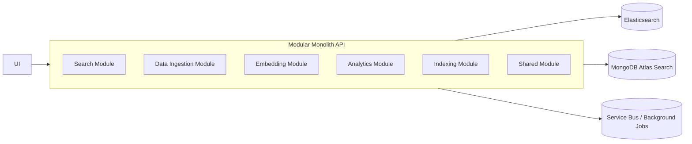

# Epic Plan: Hybrid and Vector Search Thesis Project

## Thesis Goal

Build a modular search system that compares classical keyword search, vector search, and hybrid search across Elasticsearch and MongoDB Atlas Search.

The first dataset should be articles because they are simpler to ingest, normalize, chunk, embed, index, search, and evaluate. The later extension can add books as PDF documents, where each book is split into searchable chunks and the final result is ranked back at book level.

## Current Architecture Direction



The current repository already has the beginning of this shape:

- `Bootstrapper`: ASP.NET Core entry point.
- `Shared`: common module and endpoint infrastructure.
- `DataIngestion`: first ingestion endpoint skeleton.
- `Search`: search module skeleton.

## Epic 1: Project Foundation and Architecture

### Objective

Create a stable modular monolith foundation that can support ingestion, embedding generation, indexing, searching, and analytics without mixing responsibilities.

### User Stories

- As a developer, I want each module to register its own services so the project stays organized.
- As a developer, I want shared contracts for articles, search requests, search results, and experiment metrics.
- As a developer, I want configuration for Elasticsearch, MongoDB Atlas, embedding provider, and background processing.
- As a developer, I want Swagger endpoints grouped by module.

### Main Tasks

- Clean up current module skeletons.
- Add solution structure for:
  - `Search`
  - `DataIngestion`
  - `Indexing`
  - `Embedding`
  - `Analytics`
  - `Shared.Contracts`
  - `Shared.Core`
- Add common result/error handling.
- Add module-specific dependency injection.
- Add environment-based configuration.
- Add Docker Compose for local infrastructure where possible.

### Deliverables

- Running ASP.NET Core API.
- Swagger available locally.
- Module registration working.
- Basic health endpoint.
- Configuration model documented.

### Acceptance Criteria

- API starts without manual module wiring per endpoint.
- Each module owns its own services and endpoints.
- `appsettings.Development.json` contains placeholders for required infrastructure.
- New modules can be added without changing core bootstrap logic heavily.

## Epic 2: Article Dataset and Data Model

### Objective

Define the first dataset and normalize articles into a consistent internal model that both Elasticsearch and MongoDB can index.

### User Stories

- As a researcher, I want a repeatable article dataset so experiments can be reproduced.
- As a user, I want articles to have title, body, author/source, date, category, and URL when available.
- As a developer, I want imported articles to be stored in a canonical format before indexing.

### Suggested Article Model

```csharp
public sealed class Article
{
    public string Id { get; init; }
    public string Title { get; init; }
    public string Content { get; init; }
    public string? Summary { get; init; }
    public string? Author { get; init; }
    public string? Source { get; init; }
    public string? Url { get; init; }
    public string? Category { get; init; }
    public DateTimeOffset? PublishedAt { get; init; }
    public IReadOnlyCollection<ArticleChunk> Chunks { get; init; }
}

public sealed class ArticleChunk
{
    public string Id { get; init; }
    public string ArticleId { get; init; }
    public int ChunkIndex { get; init; }
    public string Text { get; init; }
    public float[] Embedding { get; init; }
}
```

### Main Tasks

- Choose initial dataset source:
  - Kaggle/news dataset
  - manually curated CSV/JSON
  - scraped/exported article collection
- Define canonical article schema.
- Implement import from JSON/CSV.
- Validate required fields.
- Normalize text:
  - trim whitespace
  - remove broken characters
  - deduplicate repeated articles
  - preserve source metadata
- Create article chunking strategy.

### Deliverables

- Sample dataset in JSON or CSV.
- Ingestion endpoint or background job.
- Stored canonical articles.
- Clear dataset documentation.

### Acceptance Criteria

- Same input dataset can be reimported repeatedly.
- Duplicate handling is deterministic.
- Every article has stable ID generation.
- Every article can be split into chunks for vector search.

## Epic 3: Embedding Generation

### Objective

Generate semantic vector representations for article chunks so vector and hybrid search can be tested.

### User Stories

- As a researcher, I want embeddings generated consistently so search results are comparable.
- As a developer, I want embedding generation isolated behind an interface so the model can change later.
- As a developer, I want failed embedding calls to be retried or marked safely.

### Main Tasks

- Create `IEmbeddingService`.
- Choose first embedding model:
  - local Sentence-BERT for lower cost and reproducibility
  - OpenAI embeddings for quality and simplicity
- Store embedding model name and vector dimensions.
- Implement batching.
- Add retry/error handling.
- Cache embeddings so reindexing does not regenerate unchanged vectors.
- Track embedding generation time.

### Deliverables

- Embedding module.
- Embedding provider implementation.
- Article chunk embeddings.
- Embedding metadata stored with each chunk.

### Acceptance Criteria

- Each searchable article chunk has an embedding.
- Embedding dimensions match index configuration in both engines.
- Re-running ingestion does not duplicate embeddings unnecessarily.
- Embedding provider can be swapped with minimal code changes.

## Epic 4: Elasticsearch Indexing

### Objective

Index articles into Elasticsearch for BM25, vector, and hybrid retrieval.

### User Stories

- As a researcher, I want Elasticsearch BM25 search as the classical baseline.
- As a researcher, I want Elasticsearch kNN/vector search for semantic results.
- As a researcher, I want Elasticsearch hybrid search to combine lexical and semantic ranking.

### Main Tasks

- Set up local Elasticsearch and Kibana.
- Define index mappings:
  - text fields for BM25
  - keyword fields for filtering
  - dense vector field for embeddings
- Implement index creation.
- Implement bulk indexing.
- Implement reindex/reset endpoint for experiments.
- Implement Elasticsearch search strategies:
  - BM25 only
  - vector only
  - hybrid
- Tune fields and boosts:
  - title boost
  - content/chunk text
  - category/source filters

### Deliverables

- Elasticsearch index definition.
- Bulk indexing pipeline.
- Elasticsearch search adapter.
- Kibana setup notes.

### Acceptance Criteria

- Articles are indexed successfully.
- BM25 search returns keyword-relevant results.
- Vector search returns semantically related results.
- Hybrid search combines both signals.
- Search response includes score and engine metadata.

## Epic 5: MongoDB Atlas Search Indexing

### Objective

Index the same article data into MongoDB Atlas Search so its lexical, vector, and hybrid behavior can be compared with Elasticsearch.

### User Stories

- As a researcher, I want MongoDB Atlas Search configured on the same article dataset.
- As a researcher, I want vector search in MongoDB Atlas using the same embeddings.
- As a researcher, I want comparable query outputs from MongoDB and Elasticsearch.

### Main Tasks

- Set up MongoDB Atlas cluster.
- Define article collection schema.
- Define Atlas Search index.
- Define Atlas Vector Search index.
- Implement MongoDB indexing adapter.
- Implement MongoDB search strategies:
  - text search
  - vector search
  - hybrid search
- Normalize response format to match Elasticsearch adapter.

### Deliverables

- MongoDB collection setup.
- Atlas Search index definitions.
- MongoDB search adapter.
- Configuration documentation.

### Acceptance Criteria

- Same article dataset is searchable in MongoDB Atlas.
- MongoDB vector index uses same embedding dimensions as Elasticsearch.
- Search API can switch between engines.
- Results can be compared using the same response schema.

## Epic 6: Search API

### Objective

Expose a unified search API that supports engine selection, search mode selection, filters, paging, and diagnostics.

### User Stories

- As a user, I want to enter a query and get relevant articles.
- As a researcher, I want to choose BM25, vector, or hybrid search.
- As a researcher, I want to choose Elasticsearch or MongoDB as the backend.
- As a researcher, I want result metadata so I can analyze why results differ.

### Suggested Request

```json
{
  "query": "machine learning in healthcare",
  "engine": "elasticsearch",
  "mode": "hybrid",
  "topK": 10,
  "filters": {
    "category": "technology",
    "source": "sample-news"
  },
  "includeDiagnostics": true
}
```

### Suggested Response

```json
{
  "queryId": "exp-001",
  "engine": "elasticsearch",
  "mode": "hybrid",
  "elapsedMs": 42,
  "results": [
    {
      "articleId": "article-123",
      "title": "AI improves diagnostic workflows",
      "snippet": "...",
      "score": 12.42,
      "rank": 1,
      "source": "sample-news"
    }
  ]
}
```

### Main Tasks

- Define search contracts in `Shared.Contracts`.
- Add search endpoint:
  - `POST /api/search`
- Add enum/config support:
  - engine: `elasticsearch`, `mongodb`, `both`
  - mode: `bm25`, `vector`, `hybrid`
- Add result normalization.
- Add query timing.
- Add diagnostics output.
- Add input validation.

### Deliverables

- Unified search endpoint.
- Search strategy abstraction.
- Engine adapters.
- Common response format.

### Acceptance Criteria

- One endpoint can run all main search strategies.
- Same query can be executed against Elasticsearch and MongoDB.
- Response includes timing and ranking information.
- Invalid engine/mode combinations return clear validation errors.

## Epic 7: Hybrid Ranking Strategy

### Objective

Design and test the hybrid scoring method used to combine keyword and vector search results.

### User Stories

- As a researcher, I want to compare different hybrid ranking strategies.
- As a researcher, I want hybrid search to improve relevance compared to single-mode search.
- As a developer, I want ranking logic testable outside the database engines.

### Candidate Strategies

- Weighted score combination:
  - `finalScore = bm25Score * lexicalWeight + vectorScore * semanticWeight`
- Reciprocal Rank Fusion:
  - combines ranks instead of raw scores
  - useful because BM25 and vector scores are often not directly comparable
- Engine-native hybrid search:
  - use native Elasticsearch and MongoDB features where available
  - compare native behavior with application-level fusion

### Main Tasks

- Implement score normalization.
- Implement Reciprocal Rank Fusion.
- Add configuration for hybrid weights.
- Add experiments for multiple weight values.
- Store ranking diagnostics:
  - BM25 rank
  - vector rank
  - final rank
  - final score

### Deliverables

- Hybrid ranking service.
- Unit tests for ranking.
- Configurable hybrid parameters.
- Experiment results comparing ranking strategies.

### Acceptance Criteria

- Hybrid ranking works even when an article appears in only one result set.
- Ranking output is deterministic.
- Diagnostics show how final rank was produced.
- Thesis can explain the chosen hybrid strategy clearly.

## Epic 8: Analytics and Experiment Evaluation

### Objective

Measure search performance and relevance so the thesis can compare Elasticsearch and MongoDB Atlas Search scientifically.

### User Stories

- As a researcher, I want to measure query latency for each engine and mode.
- As a researcher, I want to evaluate relevance using repeatable test queries.
- As a researcher, I want charts/tables that can be used in the thesis.

### Metrics

- Performance:
  - average latency
  - p50 latency
  - p95 latency
  - indexing time
  - embedding generation time
- Relevance:
  - Precision@K
  - Recall@K
  - Mean Reciprocal Rank
  - nDCG@K
- Operational:
  - index size
  - document count
  - chunk count
  - failed ingestion count

### Main Tasks

- Define benchmark query set.
- Create relevance judgment file.
- Implement experiment runner:
  - run query against each engine
  - run each mode
  - collect latency and result IDs
- Store experiment results.
- Export results to CSV.
- Generate charts manually or through a notebook later.

### Deliverables

- Analytics module.
- Experiment runner endpoint or CLI job.
- CSV export.
- Thesis-ready result tables.

### Acceptance Criteria

- Same query set can be rerun after indexing changes.
- Results include engine, mode, query, latency, and rankings.
- Evaluation metrics are calculated consistently.
- Data can support a clear comparison chapter.

## Epic 9: UI for Search and Comparison

### Objective

Build a simple UI that lets a user search articles and lets the researcher compare engines and modes.

### User Stories

- As a user, I want to search articles from a simple input box.
- As a researcher, I want to compare Elasticsearch vs MongoDB results side by side.
- As a researcher, I want to switch between BM25, vector, and hybrid modes.

### Main Views

- Search page:
  - query input
  - engine selector
  - mode selector
  - filters
  - result list
- Comparison page:
  - same query against both engines
  - side-by-side ranked results
  - latency display
  - overlap between result sets
- Analytics page:
  - benchmark summaries
  - charts/tables

### Deliverables

- Minimal frontend.
- Search workflow connected to API.
- Comparison workflow.
- Basic analytics view.

### Acceptance Criteria

- User can run a search without Swagger.
- Comparison view makes engine differences visible.
- UI displays latency and ranking clearly.
- UI remains simple enough for thesis demonstration.

## Epic 10: Background Processing and Messaging

### Objective

Introduce service bus or background job processing for ingestion, embedding, and indexing tasks that should not run synchronously in HTTP requests.

### User Stories

- As a developer, I want ingestion to start a background process.
- As a developer, I want embedding generation and indexing to be decoupled.
- As a researcher, I want to see ingestion/indexing job status.

### Main Tasks

- Choose background mechanism:
  - MassTransit with RabbitMQ
  - Azure Service Bus
  - Hangfire for simpler local thesis workflow
- Define events:
  - `ArticleImported`
  - `ArticleChunked`
  - `EmbeddingGenerated`
  - `ArticleIndexed`
  - `IngestionFailed`
- Add job status tracking.
- Add retry/dead-letter strategy.

### Deliverables

- Background processing setup.
- Ingestion/indexing events.
- Job status endpoint.
- Failure logging.

### Acceptance Criteria

- Large ingestion does not block API request.
- Failed jobs can be inspected.
- Reprocessing is possible.
- Messaging design is documented.

## Epic 11: Book PDF Extension

### Objective

Prepare the architecture so the later book-search extension reuses the same ingestion, chunking, embedding, indexing, search, and analytics flow.

### User Stories

- As a user, I want to search books by meaning, not only by title.
- As a user, I want the system to return the most relevant books based on PDF content.
- As a researcher, I want article and book search to share the same search architecture.

### Main Tasks

- Add document type abstraction:
  - article
  - book
- Add PDF text extraction.
- Add book metadata:
  - title
  - author
  - year
  - file name
  - page count
- Split books by page/section/chunk.
- Store chunk-to-book relationship.
- Rank chunks first, then aggregate results to book level.
- Return best matching snippets/pages.

### Deliverables

- Book ingestion pipeline.
- PDF extraction service.
- Book-level search result aggregation.
- UI support for book results.

### Acceptance Criteria

- PDF text is extracted and chunked.
- Search returns books, not only isolated chunks.
- Result includes matching page/chunk snippets.
- Article search remains unaffected.

## Epic 12: Thesis Documentation

### Objective

Keep implementation and thesis writing aligned so the project produces usable academic material, not only code.

### Suggested Thesis Chapters

- Introduction
- Search fundamentals:
  - BM25
  - vector search
  - embeddings
  - hybrid search
- Elasticsearch overview
- MongoDB Atlas Search overview
- System architecture
- Implementation
- Experimental setup
- Results and comparison
- Discussion
- Conclusion and future work

### Main Tasks

- Document architecture decisions.
- Document dataset choice.
- Document embedding model choice.
- Document index mappings.
- Document query set and relevance judgments.
- Export benchmark tables.
- Capture screenshots:
  - Swagger/API
  - UI
  - Kibana
  - MongoDB Atlas Search configuration
- Write limitations:
  - dataset size
  - embedding model bias
  - network effects for Atlas
  - score comparability issues

### Deliverables

- Architecture documentation.
- Experiment methodology.
- Result tables.
- Screenshots.
- Final thesis material.

### Acceptance Criteria

- Every experiment result can be traced back to dataset, query set, engine, mode, and configuration.
- The thesis clearly explains why hybrid search is useful.
- The comparison between Elasticsearch and MongoDB Atlas Search is based on reproducible measurements.

## Recommended Implementation Order

1. Stabilize modular monolith foundation.
2. Define article model and import a small dataset.
3. Implement chunking.
4. Implement embedding generation.
5. Index articles into Elasticsearch.
6. Implement Elasticsearch BM25 search.
7. Implement Elasticsearch vector search.
8. Implement Elasticsearch hybrid search.
9. Index same data into MongoDB Atlas Search.
10. Implement MongoDB text, vector, and hybrid search.
11. Create unified search endpoint.
12. Add experiment runner and CSV export.
13. Add simple UI.
14. Write thesis architecture and methodology chapters.
15. Extend to book PDF ingestion after article flow is stable.

## Suggested MVP Scope

The MVP should prove the full research loop with articles only:

- Import 100 to 1,000 articles.
- Chunk article content.
- Generate embeddings.
- Index into Elasticsearch.
- Index into MongoDB Atlas.
- Search using BM25, vector, and hybrid mode.
- Compare latency and top 10 relevance.
- Export experiment results.

Avoid starting with books until this loop works end to end. Books add PDF extraction, larger documents, chunk aggregation, page references, and more expensive embeddings. The article MVP gives you the same architecture with much less noise.

## Key Technical Decisions to Make Early

| Decision | Recommended Starting Choice | Reason |
| --- | --- | --- |
| First dataset | Articles in JSON/CSV | Simple and reproducible |
| First API style | ASP.NET Core Minimal APIs | Matches current repository |
| First architecture | Modular monolith | Good thesis scope without microservice complexity |
| First embedding model | One fixed provider/model | Keeps comparison fair |
| First hybrid method | Reciprocal Rank Fusion | Avoids raw score incompatibility |
| First analytics format | CSV export | Easy to use in thesis tables/charts |
| Background processing | Hangfire or MassTransit/RabbitMQ | Hangfire is simpler; MassTransit better if service bus is required |

## Definition of Done for the Thesis Project

- Articles can be ingested from a repeatable dataset.
- Article chunks have embeddings.
- Elasticsearch and MongoDB Atlas contain the same searchable data.
- API supports BM25, vector, and hybrid search.
- Search results are returned in a normalized format.
- Experiments measure latency and relevance.
- Analytics output can be used directly in the thesis.
- Architecture supports later PDF/book ingestion without redesigning the whole system.
